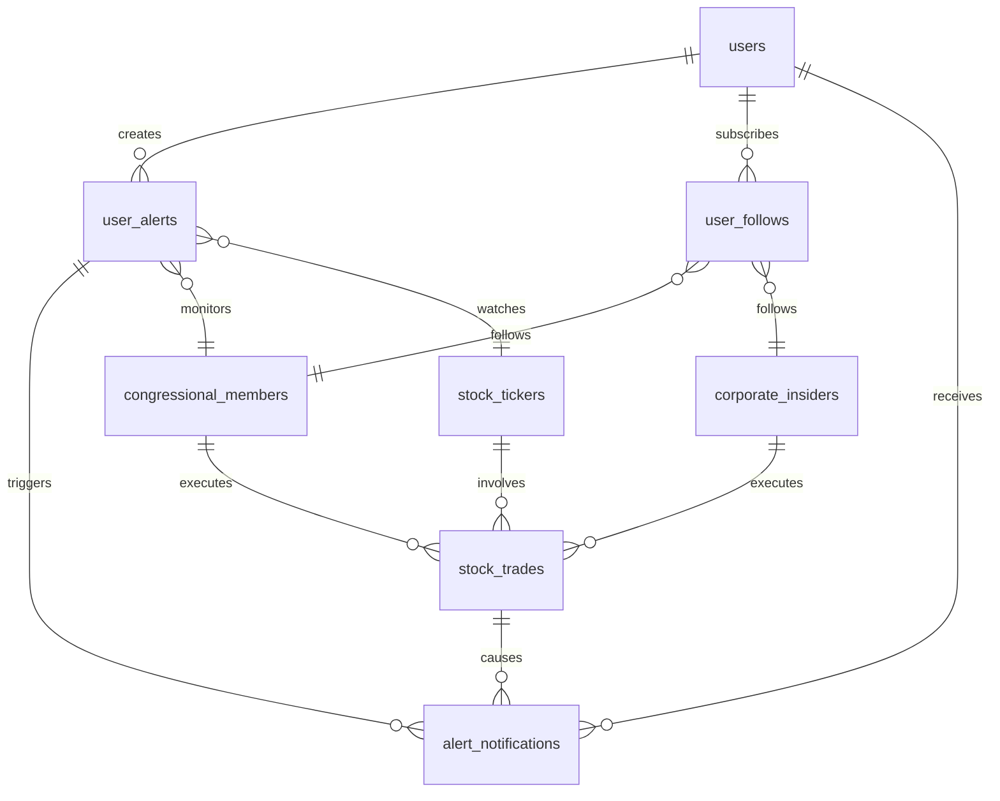

# Data Model: Congressional Trading Transparency Platform

**Date**: 2025-09-24  
**Phase**: 1 - Database Schema & Entity Design

## Core Entities

### 1. User Account
Represents platform users with authentication and billing information.

```sql
CREATE TABLE users (
    id UUID PRIMARY KEY DEFAULT gen_random_uuid(),
    email VARCHAR(255) UNIQUE NOT NULL,
    name VARCHAR(255),
    created_at TIMESTAMP WITH TIME ZONE DEFAULT NOW(),
    updated_at TIMESTAMP WITH TIME ZONE DEFAULT NOW(),
    subscription_status ENUM('active', 'suspended', 'cancelled') DEFAULT 'active',
    last_login_at TIMESTAMP WITH TIME ZONE
);

CREATE INDEX idx_users_email ON users(email);
CREATE INDEX idx_users_subscription_status ON users(subscription_status);
```

**Key Attributes**:
- `id`: Primary key (UUID for security)
- `email`: Unique identifier for authentication
- `subscription_status`: Billing state management
- Timestamps for audit trail

### 2. Congressional Member
Represents House and Senate members with their identifying information.

```sql
CREATE TABLE congressional_members (
    id UUID PRIMARY KEY DEFAULT gen_random_uuid(),
    name VARCHAR(255) NOT NULL,
    position ENUM('senator', 'representative') NOT NULL,
    state_code CHAR(2) NOT NULL,
    district INTEGER, -- NULL for senators
    party_affiliation ENUM('democratic', 'republican', 'independent', 'other'),
    office_start_date DATE,
    office_end_date DATE,
    created_at TIMESTAMP WITH TIME ZONE DEFAULT NOW(),
    updated_at TIMESTAMP WITH TIME ZONE DEFAULT NOW(),
    CONSTRAINT chk_senator_no_district CHECK (
        (position = 'senator' AND district IS NULL) OR 
        (position = 'representative' AND district IS NOT NULL)
    )
);

CREATE INDEX idx_congressional_members_name ON congressional_members(name);
CREATE INDEX idx_congressional_members_state ON congressional_members(state_code);
CREATE INDEX idx_congressional_members_position ON congressional_members(position);
CREATE UNIQUE INDEX idx_congressional_members_unique_rep ON congressional_members(state_code, district) 
    WHERE position = 'representative';
```

**Key Attributes**:
- `position`: Senator vs Representative validation
- `state_code`/`district`: Geographic representation
- `party_affiliation`: Political alignment
- Date ranges for term tracking

### 3. Corporate Insider
Represents corporate executives and insiders (Phase 2).

```sql
CREATE TABLE corporate_insiders (
    id UUID PRIMARY KEY DEFAULT gen_random_uuid(),
    name VARCHAR(255) NOT NULL,
    company_name VARCHAR(255) NOT NULL,
    position VARCHAR(255),
    ticker_symbol VARCHAR(10),
    created_at TIMESTAMP WITH TIME ZONE DEFAULT NOW(),
    updated_at TIMESTAMP WITH TIME ZONE DEFAULT NOW()
);

CREATE INDEX idx_corporate_insiders_name ON corporate_insiders(name);
CREATE INDEX idx_corporate_insiders_company ON corporate_insiders(company_name);
CREATE INDEX idx_corporate_insiders_ticker ON corporate_insiders(ticker_symbol);
```

### 4. Stock Ticker
Represents publicly traded companies and their stock information.

```sql
CREATE TABLE stock_tickers (
    symbol VARCHAR(10) PRIMARY KEY,
    company_name VARCHAR(255) NOT NULL,
    sector VARCHAR(100),
    industry VARCHAR(100),
    market_cap BIGINT,
    last_price DECIMAL(10,2),
    last_updated TIMESTAMP WITH TIME ZONE DEFAULT NOW(),
    created_at TIMESTAMP WITH TIME ZONE DEFAULT NOW()
);

CREATE INDEX idx_stock_tickers_company_name ON stock_tickers(company_name);
CREATE INDEX idx_stock_tickers_sector ON stock_tickers(sector);
```

**Key Attributes**:
- `symbol`: Primary key (stock ticker)
- Market classification fields for analytics
- Price tracking for valuation calculations

### 5. Stock Trade
Represents individual trading transactions from both congressional members and corporate insiders.

```sql
CREATE TYPE trader_type AS ENUM ('congressional', 'corporate');
CREATE TYPE transaction_type AS ENUM ('buy', 'sell', 'exchange');

CREATE TABLE stock_trades (
    id UUID PRIMARY KEY DEFAULT gen_random_uuid(),
    trader_type trader_type NOT NULL,
    trader_id UUID NOT NULL,
    ticker_symbol VARCHAR(10) NOT NULL REFERENCES stock_tickers(symbol),
    transaction_date DATE NOT NULL,
    transaction_type transaction_type NOT NULL,
    amount_range VARCHAR(50), -- e.g., "$1,001 - $15,000"
    estimated_value DECIMAL(12,2), -- Calculated midpoint
    quantity INTEGER,
    filing_date DATE,
    source_data JSONB, -- Raw FMP API response
    created_at TIMESTAMP WITH TIME ZONE DEFAULT NOW(),
    updated_at TIMESTAMP WITH TIME ZONE DEFAULT NOW()
);

-- Indexes for performance
CREATE INDEX idx_stock_trades_trader ON stock_trades(trader_type, trader_id);
CREATE INDEX idx_stock_trades_ticker ON stock_trades(ticker_symbol);
CREATE INDEX idx_stock_trades_date ON stock_trades(transaction_date DESC);
CREATE INDEX idx_stock_trades_type ON stock_trades(transaction_type);
CREATE INDEX idx_stock_trades_compound ON stock_trades(trader_type, trader_id, transaction_date DESC);

-- Foreign key constraints based on trader_type
CREATE INDEX idx_stock_trades_congressional_fk ON stock_trades(trader_id) 
    WHERE trader_type = 'congressional';
CREATE INDEX idx_stock_trades_corporate_fk ON stock_trades(trader_id) 
    WHERE trader_type = 'corporate';
```

**Key Attributes**:
- Polymorphic `trader_type`/`trader_id` for congressional or corporate traders
- `amount_range`: Raw disclosure data (often ranges, not exact amounts)
- `estimated_value`: Calculated midpoint for analytics
- `source_data`: JSONB for flexible FMP API response storage

### 6. User Alert
Represents user-created monitoring rules for specific politicians, stocks, or trading patterns.

```sql
CREATE TYPE alert_type AS ENUM ('politician', 'stock', 'pattern');
CREATE TYPE alert_status AS ENUM ('active', 'paused', 'deleted');

CREATE TABLE user_alerts (
    id UUID PRIMARY KEY DEFAULT gen_random_uuid(),
    user_id UUID NOT NULL REFERENCES users(id) ON DELETE CASCADE,
    alert_type alert_type NOT NULL,
    alert_status alert_status DEFAULT 'active',
    
    -- Alert criteria (polymorphic based on alert_type)
    politician_id UUID, -- References congressional_members(id) when alert_type = 'politician'
    ticker_symbol VARCHAR(10), -- References stock_tickers(symbol) when alert_type = 'stock'
    pattern_config JSONB, -- Flexible patterns when alert_type = 'pattern'
    
    -- Notification preferences
    created_at TIMESTAMP WITH TIME ZONE DEFAULT NOW(),
    updated_at TIMESTAMP WITH TIME ZONE DEFAULT NOW(),
    last_triggered_at TIMESTAMP WITH TIME ZONE
);

CREATE INDEX idx_user_alerts_user ON user_alerts(user_id);
CREATE INDEX idx_user_alerts_status ON user_alerts(alert_status);
CREATE INDEX idx_user_alerts_politician ON user_alerts(politician_id) WHERE politician_id IS NOT NULL;
CREATE INDEX idx_user_alerts_ticker ON user_alerts(ticker_symbol) WHERE ticker_symbol IS NOT NULL;
```

**Key Attributes**:
- Polymorphic design supports multiple alert types
- `pattern_config`: JSONB for complex alert criteria
- Status tracking for alert management

### 7. User Follow
Represents the billable relationship when users "follow" specific politicians/insiders for detailed tracking.

```sql
CREATE TABLE user_follows (
    id UUID PRIMARY KEY DEFAULT gen_random_uuid(),
    user_id UUID NOT NULL REFERENCES users(id) ON DELETE CASCADE,
    trader_type trader_type NOT NULL,
    trader_id UUID NOT NULL,
    followed_at TIMESTAMP WITH TIME ZONE DEFAULT NOW(),
    unfollowed_at TIMESTAMP WITH TIME ZONE,
    billing_status ENUM('active', 'suspended', 'cancelled') DEFAULT 'active'
);

CREATE UNIQUE INDEX idx_user_follows_unique_active ON user_follows(user_id, trader_type, trader_id)
    WHERE unfollowed_at IS NULL;
CREATE INDEX idx_user_follows_user ON user_follows(user_id);
CREATE INDEX idx_user_follows_billing ON user_follows(billing_status);
CREATE INDEX idx_user_follows_trader ON user_follows(trader_type, trader_id);
```

**Billing Model**:
- Each active follow = 1 billing unit per month
- `unfollowed_at` = NULL means active subscription
- Daily job counts active follows per user for billing

### 8. Alert Notification
Tracks delivered notifications for audit and user history.

```sql
CREATE TABLE alert_notifications (
    id UUID PRIMARY KEY DEFAULT gen_random_uuid(),
    alert_id UUID NOT NULL REFERENCES user_alerts(id) ON DELETE CASCADE,
    user_id UUID NOT NULL REFERENCES users(id) ON DELETE CASCADE,
    trade_id UUID REFERENCES stock_trades(id),
    notification_type ENUM('in_app') DEFAULT 'in_app',
    message TEXT NOT NULL,
    delivered_at TIMESTAMP WITH TIME ZONE DEFAULT NOW(),
    read_at TIMESTAMP WITH TIME ZONE
);

CREATE INDEX idx_alert_notifications_user ON alert_notifications(user_id, delivered_at DESC);
CREATE INDEX idx_alert_notifications_alert ON alert_notifications(alert_id);
CREATE INDEX idx_alert_notifications_unread ON alert_notifications(user_id) WHERE read_at IS NULL;
```

## Derived Analytics Tables

### 9. Portfolio Concentration (Materialized View)
Pre-calculated analytics for portfolio concentration per politician/insider.

```sql
CREATE MATERIALIZED VIEW portfolio_concentration AS
SELECT 
    trader_type,
    trader_id,
    ticker_symbol,
    SUM(CASE WHEN transaction_type = 'buy' THEN estimated_value 
             WHEN transaction_type = 'sell' THEN -estimated_value 
             ELSE 0 END) as net_position_value,
    COUNT(*) as transaction_count,
    MAX(transaction_date) as latest_transaction,
    -- Portfolio concentration metrics
    SUM(estimated_value) OVER (PARTITION BY trader_type, trader_id) as total_portfolio_value,
    (SUM(CASE WHEN transaction_type = 'buy' THEN estimated_value 
              WHEN transaction_type = 'sell' THEN -estimated_value 
              ELSE 0 END) / 
     SUM(estimated_value) OVER (PARTITION BY trader_type, trader_id)) * 100 as position_percentage
FROM stock_trades
WHERE transaction_date >= NOW() - INTERVAL '2 years'
GROUP BY trader_type, trader_id, ticker_symbol
HAVING SUM(CASE WHEN transaction_type = 'buy' THEN estimated_value 
                WHEN transaction_type = 'sell' THEN -estimated_value 
                ELSE 0 END) > 0;

CREATE INDEX idx_portfolio_concentration_trader ON portfolio_concentration(trader_type, trader_id);
CREATE INDEX idx_portfolio_concentration_position ON portfolio_concentration(position_percentage DESC);
```

## Entity Relationships



## Data Validation Rules

### Business Rules
1. **Congressional Members**: Cannot have duplicate active representatives for same state/district
2. **Stock Trades**: Must have valid ticker_symbol referencing stock_tickers
3. **User Alerts**: Politician alerts must reference existing congressional_members
4. **User Follows**: Cannot follow same trader multiple times simultaneously
5. **Billing**: Active follows must have valid user with active subscription

### Data Integrity
1. **Soft Deletes**: User alerts use status field, not physical deletion
2. **Audit Trail**: All entities have created_at/updated_at timestamps
3. **Foreign Keys**: Cascading deletes for user-owned data
4. **Polymorphic References**: trader_type validates trader_id relationships

### Performance Optimization
1. **Compound Indexes**: Optimize common query patterns (trader + date)
2. **Materialized Views**: Pre-calculate expensive aggregations
3. **Partitioning**: Consider date-based partitioning for stock_trades table at scale
4. **Connection Pooling**: Manage database connections efficiently

## Migration Strategy

### Phase 1: Core Platform
- Users, Congressional Members, Stock Tickers, Stock Trades
- User Alerts, User Follows, Alert Notifications
- Basic portfolio concentration analytics

### Phase 2: Corporate Insiders
- Corporate Insiders table
- Update polymorphic relationships in existing tables
- Extend analytics to include insider data

### Phase 3: Advanced Analytics
- Additional materialized views for sector analysis
- Historical trend calculations
- Performance correlation tracking

This data model supports all functional requirements while maintaining flexibility for future enhancements and ensuring optimal query performance for the expected user interactions.